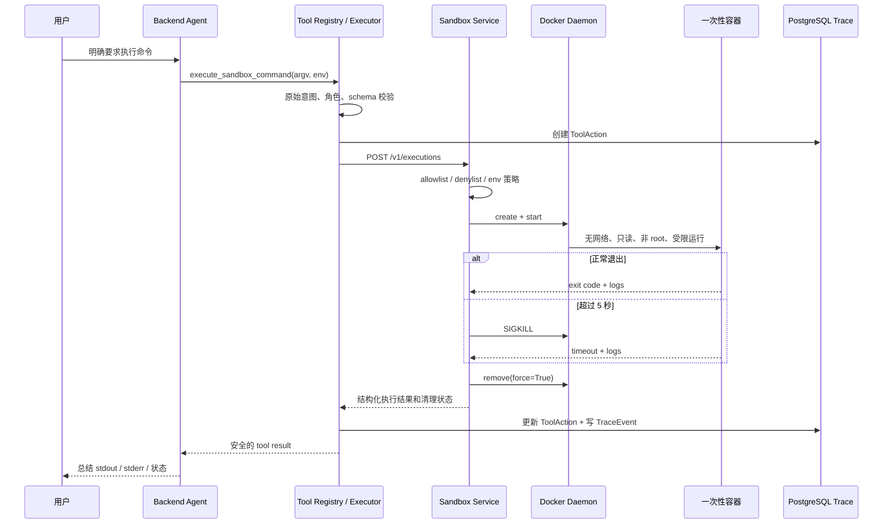

# Day 7 Docker 一次性命令沙箱

## 1. Day 7 到底增加了什么

Day 7 没有把整个 RAG Agent 搬进一个临时容器。Backend、数据库、Redis、MinIO、Worker 和前端仍然按照之前的方式长期运行。

新增的是一个独立的 `sandbox-service`。当用户明确要求 Agent 执行命令时，Backend 把这一条命令交给 sandbox service；sandbox service 再通过 Docker SDK 创建一个只活几秒的一次性容器。命令完成、失败或超时以后，服务先采集日志，再删除容器。

这样分层的原因是：Backend 需要访问数据库、Redis、模型 API 和知识库，不适合每轮都销毁；真正需要隔离的是模型提出的命令。

## 2. Docker 初学者需要理解的五个概念

### Docker image（镜像）

镜像可以理解为只读的运行模板。本项目固定使用 `python:3.13-slim` 作为命令运行环境。模型不能选择镜像，因此不能换成带特殊工具或恶意入口点的镜像。

### Docker container（容器）

容器是镜像的一次运行实例。每条命令使用一个新容器，互相看不到文件；命令结束后容器被删除。

### Docker daemon

真正负责创建、启动、停止和删除容器的后台程序。Windows 下通常由 Docker Desktop 提供。

### Docker SDK for Python

它允许 sandbox service 用 Python 调用 Docker daemon，作用类似于程序化执行 `docker create`、`docker start`、`docker wait`、`docker logs`、`docker kill` 和 `docker rm`。

### Docker socket

`/var/run/docker.sock` 是本地服务与 Docker daemon 通信的控制入口。能访问它的进程几乎等于能控制 Docker 主机，所以它只挂载给 sandbox service；Backend 和执行容器都看不到它。

## 3. 完整执行时序



### Agent 工具可见性

`execute_sandbox_command` 不是每次都暴露给模型。必须同时满足：

1. 当前服务端角色拥有 `sandbox.execute`，默认由 `operator` 角色提供。
2. 原始用户消息明确包含“执行命令”“运行命令”“Docker 沙箱”“运行 Python”等意图。
3. 授权只根据原始用户消息生成。知识库文档、长期记忆和之前的工具输出不能授权执行。

如果 DashScope 不可用，系统只会解析用户明确写出的 JSON `argv:`，不会尝试把自然语言猜成 shell 命令。

## 4. 为什么必须使用 argv，而不是 shell 字符串

安全接口：

```json
{"argv":["python","-c","print(6*7)"],"env":{}}
```

不支持的接口：

```text
python -c "print(6*7)" | tee result.txt
```

结构化 argv 会直接交给容器进程，不经过 `sh -c`，所以 `$()`、反引号、管道、重定向和 `&&` 不会被 shell 二次解释。除 Python 代码需要的换行/制表符外，控制字符会被拒绝；首版也直接拒绝 `sh`、`bash`、`ash` 等 shell。

## 5. 命令策略

### Allowlist

首版允许：

- Python：`python`、`python3`，只允许 `-c <code>` 和版本查询。
- 输出与目录：`echo`、`printf`、`pwd`、`ls`。
- 只读文本：`cat`、`head`、`tail`、`grep`、`wc`、`sort`、`uniq`。
- 超时验收：`sleep`，参数限制在 0–60 秒。

文件型命令只能访问 `/workspace`，禁止绝对宿主路径和 `..` 父目录跳转。

### Denylist

拒绝列表覆盖：

- Shell：`sh`、`bash`、`ash`。
- 删除和磁盘：`rm`、`mount`、`dd`、`mkfs`、`fdisk`。
- 提权和进程控制：`sudo`、`su`、`chmod`、`chown`、`kill`。
- 网络：`curl`、`wget`、`nc`、`ssh`、`scp`。
- 容器控制：`docker`、`dockerd`、`podman`。
- 安装软件：`apk`、`apt`、`yum`、`pip`。

策略还拒绝 Docker socket、host namespace、`--privileged` 和明显的 Python 子进程/shell 调用。

需要注意：文本 denylist 不可能理解任意 Python 程序的完整语义。Python 任意代码的最终安全边界仍然是容器无宿主挂载、无网络、非 root、capabilities 清空和硬资源限制。

## 6. 容器安全参数

| 参数 | 默认值 | 作用 |
|---|---:|---|
| network | `none` | 不能访问公网、内网或其他 Compose 服务 |
| root filesystem | read-only | 不能修改镜像系统文件 |
| `/workspace` | 32 MiB tmpfs | 允许临时写入，容器删除后消失 |
| `/tmp` | 16 MiB tmpfs | 提供受限临时目录 |
| user | `65532:65532` | 命令不以 root 运行 |
| capabilities | drop `ALL` | 移除额外内核能力 |
| no-new-privileges | true | 进程不能获得新权限 |
| memory | 128 MiB | 防止吃光宿主内存 |
| swap | 与 memory 相同 | 不额外使用 swap |
| CPU | 0.5 core | 防止长期占满 CPU |
| PID | 64 | 限制 fork/process bomb |
| timeout | 5 秒 | 超时后强制 kill |
| concurrency | 2 | 限制同时创建的容器数 |
| stdout/stderr | 各 64 KiB | 防止日志撑爆数据库 |

日志超过上限会设置 `*_truncated=true`，同时保存原始字节数和完整内容 SHA-256。

## 7. API key 为什么不会进入容器

sandbox service 绝不使用 `os.environ.copy()` 构造容器环境，只从空环境开始添加：

- 服务端固定的 `PATH`、`HOME`、`TMPDIR`。
- 白名单中的 `LANG`、`LC_ALL`、`TZ`、`PYTHONUNBUFFERED`。

名称包含 `KEY`、`TOKEN`、`SECRET`、`PASSWORD`、`CREDENTIAL`、`AUTH`、`COOKIE` 的变量会被 Backend 和 sandbox service 双重拒绝。

因此 `DASHSCOPE_API_KEY` 只存在于 Backend/Worker；内部 `SANDBOX_SERVICE_TOKEN` 只存在于 Backend 和 sandbox service；二者都不会传给执行容器。

## 8. 状态和审计语义

`ToolAction.status` 的含义：

- `executed`：容器确实运行过。内部 `execution_status` 再区分 `succeeded`、`nonzero_exit`、`timed_out`。
- `blocked`：意图、权限、参数或 sandbox policy 拒绝，未创建容器。
- `pending`：调用方设置 `auto_approve=false`，合法命令等待人工审批。
- `failed`：Docker daemon、固定镜像或内部服务通信故障。

记录内容包括 argv 摘要、策略规则、容器 ID、固定镜像、资源限制、stdout、stderr、退出码、超时、耗时、字节数、hash、截断标志和清理结果。

同一结果写入：

- `tool_actions.result`：工具级完整审计。
- `agent_trace_events.output_payload`：Agent 状态时间线。
- Agent 页“工具与审批”标签：面向使用者展示。

## 9. 清理与崩溃恢复

正常执行使用 `finally` 强制删除容器。`/workspace` 和 `/tmp` 是 tmpfs，不使用宿主 bind 目录，容器删除后不会留下文件。

如果 sandbox service 或 Docker Desktop 在执行中崩溃，容器可能来不及进入 `finally`。所有沙箱容器都带 `com.agent-loop.sandbox=true` 和 action ID 标签；服务启动时只清理超过 5 分钟的这一类容器，不执行全局 `docker prune`，避免误删用户自己的容器。

## 10. 启动与验收

### 前置检查

```powershell
docker version
docker-compose version
docker info
```

如果 `docker info` 报告无法连接 `docker_engine`：

1. 启动 Docker Desktop，并等待状态变为 Running。
2. 关闭当前终端后重新打开。
3. 确认当前 Windows 用户有权使用 Docker Desktop。
4. 本机若没有 `docker compose` 子命令，使用已安装的 `docker-compose`。

### 启动

```powershell
Copy-Item .env.example .env
docker-compose up -d --build
docker-compose ps
docker-compose logs sandbox-service
```

sandbox service 不发布宿主端口，只能由 Compose 网络内的 Backend 访问。

### 自动化测试

```powershell
docker-compose run --rm sandbox-service python -m unittest discover -s tests -v
docker-compose run --rm backend python -m unittest discover -s tests -v
```

真实 Docker 沙箱测试：

```powershell
docker-compose run --rm -e RUN_DOCKER_SANDBOX_INTEGRATION=1 sandbox-service `
  python -m unittest tests.test_docker_integration -v
```

### Agent 页面手工验收

安全命令：

```text
请在 Docker 沙箱执行命令 argv: ["python","-c","print(6*7)"]
```

预期：stdout 为 `42`，exit code 为 0，清理显示“已销毁”。

危险命令：

```text
请在 Docker 沙箱执行命令 argv: ["rm","-rf","/"]
```

预期：action 为 `blocked`，policy rule 为 `denylist`，没有 container ID。

超时命令：

```text
请在 Docker 沙箱执行命令 argv: ["sleep","30"]
```

预期：约 5 秒后 `execution_status=timed_out`，容器被 kill 并删除。

执行结束后检查没有遗留容器：

```powershell
docker ps -a --filter "label=com.agent-loop.sandbox=true"
```

## 11. 安全边界与生产建议

这个实现适合本地学习、MVP 和 Day 7 验收，但容器不是绝对安全的虚拟机。sandbox service 本身持有 Docker socket，是整个设计里权限最高的边界，不能暴露到公网，也不能让请求方控制 Docker 创建参数。

生产环境应进一步考虑：

- 把 sandbox service 和 Docker daemon 放到独立机器或 VM。
- 使用 rootless Docker、受限 Docker API proxy 或 daemon authorization plugin。
- 固定镜像 digest，并进行镜像漏洞扫描和定期更新。
- 对租户增加独立并发、速率、预算和审计告警。
- 对更高风险代码使用 gVisor、Kata Containers、Firecracker 等更强隔离层。
