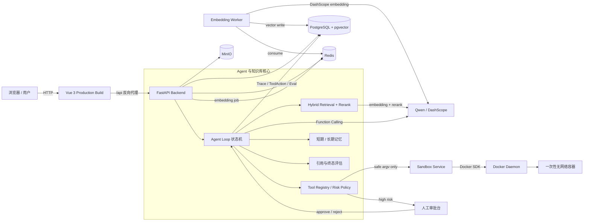
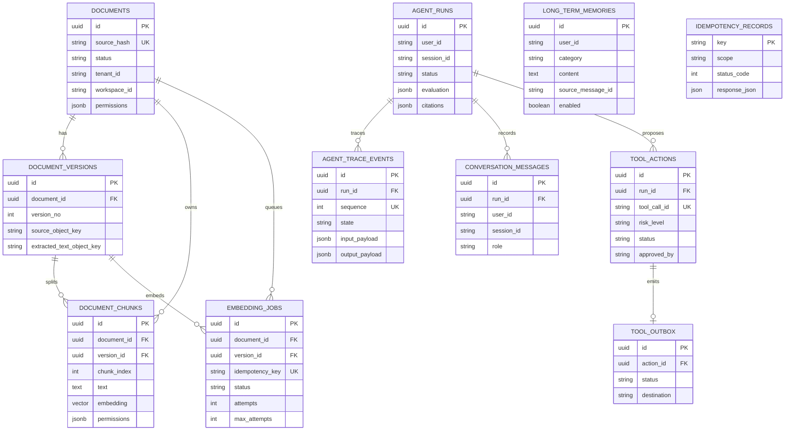
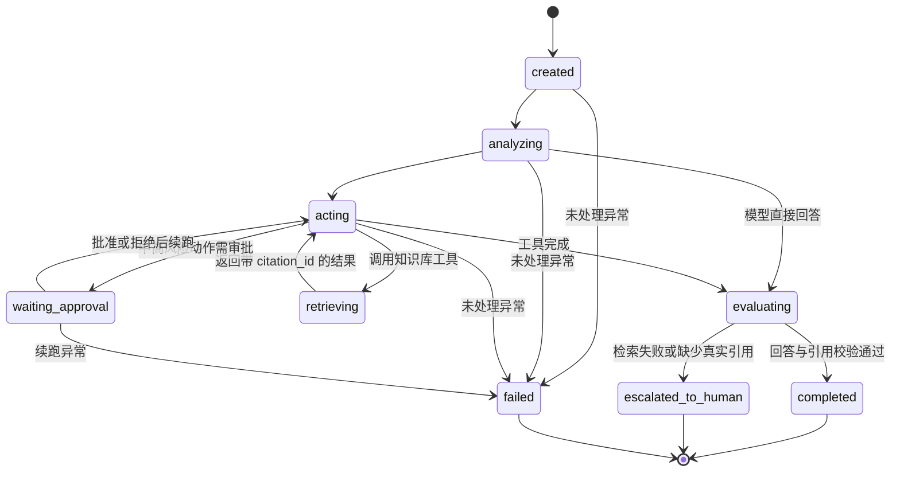
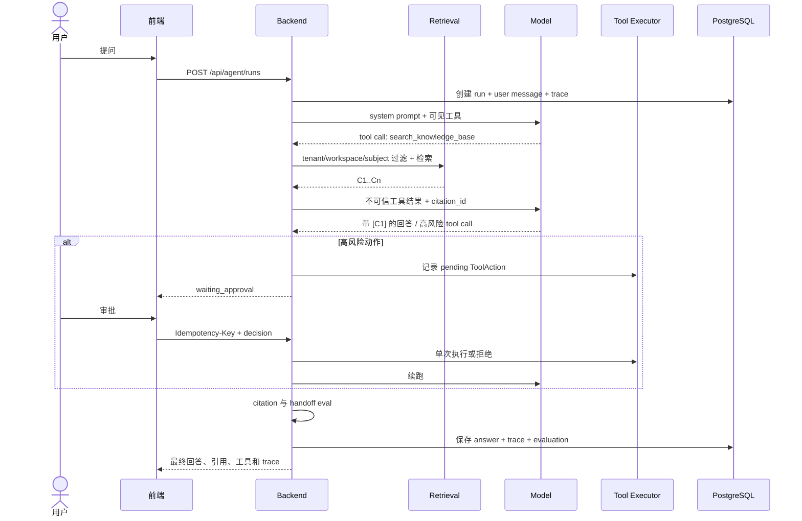

# Agent Loop Day 10 架构与数据模型

## 1. 系统架构图

关键边界：Backend 不持有 Docker socket；只有 Sandbox Service 能创建一次性容器。角色和权限由服务端配置决定，前端请求体不能自行声明角色。知识库、记忆和工具输出均视为不可信数据，不能扩大原始用户意图授权。

## 2. 数据库关系图

`LONG_TERM_MEMORIES` 的来源 ID 刻意不设外键：原始文档被删除后，记忆仍需保留可审计的稳定来源标识。`IDEMPOTENCY_RECORDS` 同时保护上传、删除和审批 API；`TOOL_ACTIONS(run_id, tool_call_id)` 约束避免同一模型调用重复落库。

## 3. Agent 状态机图

每次迁移都会生成递增 `sequence` 的 `AgentTraceEvent`。终态不是只看模型文本：如果知识库路径已执行但最终答案未引用本轮真实 `C<n>`，系统会把运行标记为 `escalated_to_human`。

## 4. 完整请求时序

